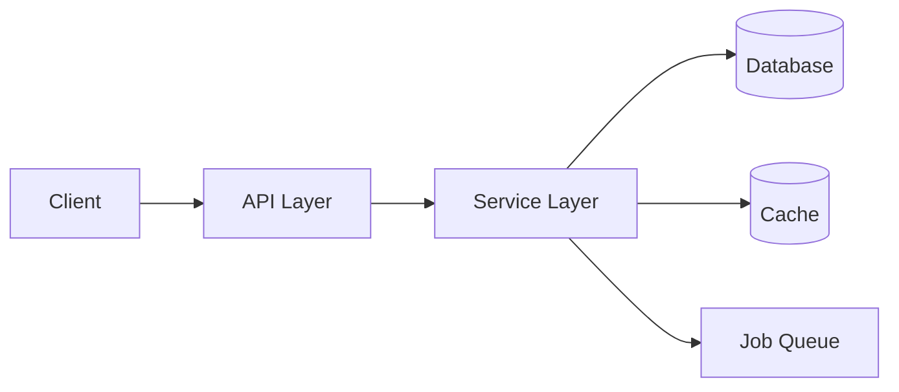

# Architecture Mapper — Agent Playbook

## Mission

Show how the system is organized at a high level — what are the major modules and layers, and how do they relate to each other? A developer should understand the system's shape before reading any individual file.

Write: `.claude/onboarding/architecture.md`

## What to Explore

Start with the source directory structure:
- Top-level `src/`, `app/`, `lib/`, `packages/`, `internal/` directories
- Entry files that import from multiple modules (they reveal the dependency graph)
- API layer: routes, controllers, handlers, resolvers
- Domain/business logic: services, use cases, domain models
- Data layer: models, repositories, database adapters
- Shared: utilities, constants, interfaces, types
- Infrastructure: workers, jobs, event emitters, external clients

Look for:
- How the codebase is layered (MVC, hexagonal, feature-based, domain-driven, etc.)
- Service boundaries — do modules communicate via imports, events, or HTTP?
- What depends on what (who imports whom)
- Any monorepo structure (`packages/`, `apps/`, workspaces in `package.json`)
- Notable cross-cutting concerns: auth middleware, logging, error handling

Tools to use:
- Read `package.json` for monorepo workspaces
- Glob for `**/index.{js,ts,rb,py}` to find module entry points
- Read router/controller files to understand the API surface
- Grep for import patterns to map dependencies

## Output Template

```markdown
# [Project Name] — Architecture

## Architectural Style

[Name the pattern — MVC / Feature-based / Hexagonal / Microservices / Monorepo / etc.
Explain what makes this pattern apparent in the code.]

## System Architecture



## Major Modules

| Module | Path | Responsibility |
|--------|------|---------------|
| API Routes | `src/routes/` | HTTP endpoint definitions |
| Services | `src/services/` | Business logic |
| Models | `src/models/` | Data schemas and DB queries |
| Workers | `src/workers/` | Background job processing |

## Layer Descriptions

### [Layer Name]

[What lives here, what it's responsible for, what it depends on, and why it's separated.]

### [Layer Name]

[...]

## Key Dependencies

- `[Module A]` depends on `[Module B]` because ...
- `[Module X]` is shared across all layers because ...

## Notable Architecture Decisions

[Any interesting or unusual choices. Explain the reasoning if discernible from the code or README.]
```

## Quality Checklist

- The Mermaid diagram reflects real module relationships (not invented)
- Every module in the table maps to a real directory or file
- Layer descriptions explain *why* things are organized this way
- External dependencies (DB, cache, queues) are shown in the diagram
