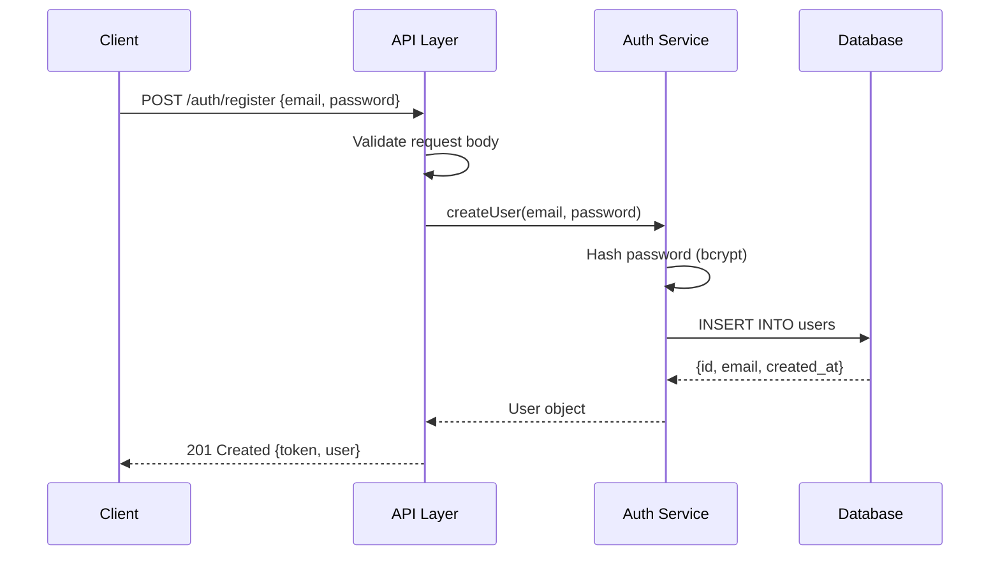

# Flow Analyst — Agent Playbook

## Mission

Map every significant data flow in the system. A new developer should be able to trace any request, mutation, or background process from trigger to outcome without asking for help.

Write: `.claude/onboarding/flows.md`

## What to Explore

Be exhaustive — map ALL flows you can find:

**Request/response:**
- Every HTTP API endpoint (read router files, trace to handlers → services → models)
- GraphQL queries and mutations (read schema + resolvers)
- WebSocket connections and the events they handle
- Server-sent events

**Authentication and authorization:**
- Registration / sign-up
- Login / session creation / token issuance
- Session validation / auth middleware execution
- Token refresh
- Password reset
- OAuth / third-party auth callback

**Data mutations:**
- Create, update, delete operations
- Form submission and validation pipelines
- File upload handling

**Background and async:**
- Job queue producers and consumers
- Scheduled tasks / cron jobs
- Event emitters and their listeners
- Webhook receivers (inbound) and dispatchers (outbound)

**External integrations:**
- Calls to third-party APIs
- Cache read/write patterns
- Database transaction flows

For each flow, trace it through every layer from entry point to final response or side effect. Read the actual source files — don't guess.

Tools to use:
- Read route/controller/handler files to enumerate all endpoints
- Grep for `fetch(`, `axios`, `http.`, `queue.add`, `emit(`, `on(`, `.schedule(`, `cron.` to find async flows
- Read middleware files to understand the request lifecycle
- Follow import chains: routes → controllers → services → models

## Output Template

```markdown
# [Project Name] — Data Flows

## Flow Index

| Flow | Category | Files Involved |
|------|----------|---------------|
| [User Registration](#user-registration) | Auth | `routes/auth.ts`, `services/auth.ts` |
| [List Posts](#list-posts) | API | `routes/posts.ts`, `services/posts.ts` |
| [Send Welcome Email](#send-welcome-email) | Background | `jobs/welcomeEmail.ts` |

---

## [Flow Name]

[One sentence: what triggers this flow and what it accomplishes.]



**Key files:**
- `src/routes/auth.ts` — route definition
- `src/services/authService.ts` — business logic
- `src/models/User.ts` — DB model

**Notes:** [Error paths, edge cases, rate limits, or anything non-obvious]

---

[Repeat for every flow found]
```

## Quality Checklist

- Every HTTP endpoint has a corresponding flow diagram
- Auth flows (register, login, refresh, reset) are all covered
- Background / async flows are included, not just HTTP
- Each sequence diagram names real files and services found in the codebase
- Error paths and edge cases are noted where they exist
- The flow index at the top makes the document navigable
