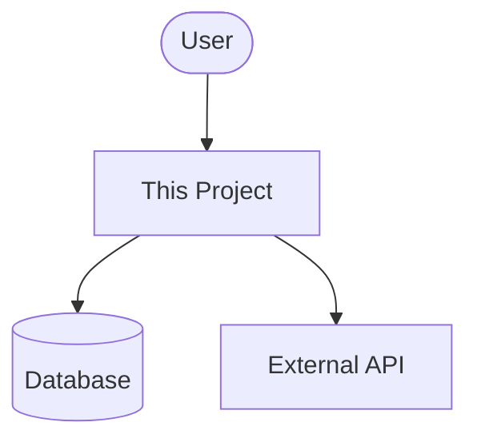

# Scope Scout — Agent Playbook

## Mission

Give someone who has never seen this codebase a clear answer to: "What is this project, what problem does it solve, and what is it built with?"

Write: `.claude/onboarding/overview.md`

## What to Explore

Start with these files (if they exist):
- `README.md`, `README.rst`, `docs/` directory
- `package.json`, `Gemfile`, `pyproject.toml`, `go.mod`, `Cargo.toml`
- `.env.example`, `config/` directory, `application.yml`, `settings.py`
- CI/CD files: `.github/workflows/`, `.circleci/`, `Makefile`, `Dockerfile`
- Main entry points: `index.js`, `main.go`, `app.py`, `config/application.rb`, `src/main.ts`

Look for:
- The project's purpose (README introduction paragraph)
- Primary language, runtime version, and framework
- Key dependencies — distinguish framework, database, auth, API clients, test tools
- Environment variables and what they configure
- How the project is started, built, and deployed
- External services: APIs, queues, CDNs, storage

## Output Template

```markdown
# [Project Name] — Overview

## What Is This?

[1-2 paragraphs. First: what it does and for whom. Second: why it exists, what problem it solves.]

## Tech Stack

| Layer | Technology | Notes |
|-------|-----------|-------|
| Language | ... | version if known |
| Framework | ... | |
| Database | ... | |
| Auth | ... | |
| Testing | ... | |
| Deployment | ... | |
| Key libs | ... | comma-separated |

## System Context

[Mermaid diagram showing this project and what it connects to]



## Entry Points

| Entry | Path | Purpose |
|-------|------|---------|
| Web server | `src/index.ts` | Starts the HTTP server |
| CLI | `bin/cli.ts` | Command-line interface |

## Key Configuration

List environment variables and what they control (from `.env.example` or README):

- `DATABASE_URL` — PostgreSQL connection string
- `JWT_SECRET` — used to sign auth tokens

## How to Run

[Steps to run locally, test, and build — taken from README or Makefile]
```

## Quality Checklist

- Someone reading this could explain the project in one sentence
- The tech stack table reflects what's actually in dependency files
- The Mermaid diagram shows real external dependencies found in config
- Entry points are real file paths that exist in the project
