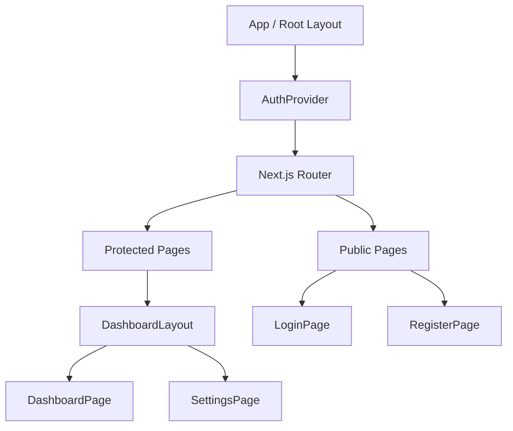
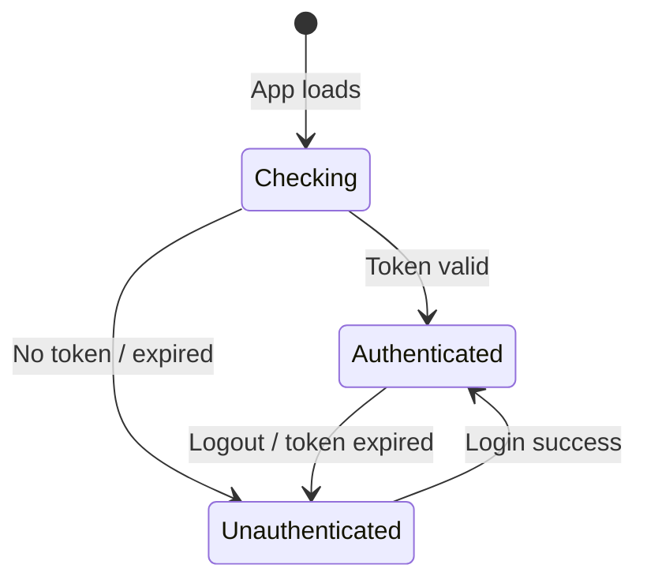
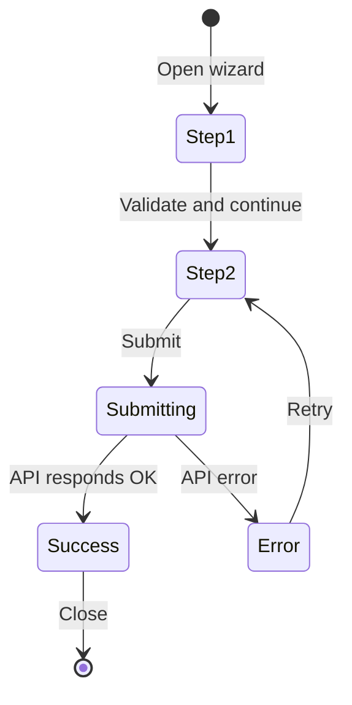

# UI Explorer — Agent Playbook

## Mission

Map the frontend UI — component hierarchy, routing, state management, and behavior of complex stateful components. A developer should have a clear mental model of the UI structure before opening a single component file.

Only run if the project has frontend code (React, Vue, Svelte, Angular, etc.).

Write: `.claude/onboarding/components.md`

## What to Explore

**Component hierarchy:**
- Root component / app entry point
- Layout components (shells, wrappers, providers, contexts)
- Page or route-level components
- Feature-level components
- Shared / atomic components (buttons, inputs, modals, tables)

**Server/Client Component split (if coordinator reports RSC usage):**
- Grep for `'use client'` directives — these mark where the server rendering tree ends
- Note which components are server-only (data fetching, async, no browser APIs) vs client (useState, event handlers, browser APIs)
- Identify the boundary pattern: server components compose client components as leaves, not vice versa
- Find components that pass serializable props from server to client — these are the bridge points

**Routing:**
- Router configuration (React Router, Next.js App Router, vue-router, etc.)
- Route structure and nesting
- Protected routes and auth guards
- Dynamic route segments

**State management:**
- Global state: Redux, Zustand, Jotai, MobX, Pinia, Context API
- Server state: React Query, SWR, Apollo, tRPC
- Form state: React Hook Form, Formik, VeeValidate
- Local state patterns and when they're used

**Complex stateful components:**
- Multi-step forms or wizards
- Modals and dialogs with non-trivial lifecycle
- Data tables with filtering, sorting, and pagination
- Real-time UI driven by WebSocket or SSE
- Auth state machine (loading → authenticated → unauthenticated → expired)

**Styling:**
- CSS methodology: Tailwind / CSS Modules / styled-components / Sass / vanilla
- Design tokens, theme configuration, or CSS variables
- Responsive breakpoint approach

Tools to use:
- Glob for `**/*.tsx`, `**/*.vue`, `**/*.svelte` to find component files
- Read the router config to map the route tree
- Read store/context definitions to understand global state shape
- Grep for `useState`, `useReducer`, `createMachine` to find complex local state

## Output Template

```markdown
# [Project Name] — UI Components

## Tech Stack

| Concern | Solution |
|---------|---------|
| Framework | React 18 / Next.js 14 |
| Routing | Next.js App Router |
| Global state | Zustand |
| Server state | React Query |
| Forms | React Hook Form |
| Styling | Tailwind CSS |

## Component Hierarchy



## Server/Client Boundary

[Only include this section if the project uses React Server Components (`'use client'` directives present).]

[Describe where `'use client'` is placed and why — which components need client interactivity vs which are server-rendered.]

| Component | Type | Reason |
|-----------|------|--------|
| `Button.tsx` | Client | Uses `onClick` event handler |
| `UserList.tsx` | Server | Fetches data directly, no interactivity |
| `Dashboard.tsx` | Server | Composes server + client children |

## Route Structure

| Route | Component | Auth Required |
|-------|-----------|---------------|
| `/` | `app/page.tsx` | No |
| `/dashboard` | `app/dashboard/page.tsx` | Yes |
| `/settings` | `app/settings/page.tsx` | Yes |

## State Management

### Global State ([Library])

[What lives in global state, why it's global, how it's organized.]

### Server State ([Library])

[How API data is fetched and cached. Key queries and mutations.]

## Auth State Machine



## Complex Component: [Name]

[For notably complex stateful components — describe their behavior with a state diagram.]



Found in: `src/components/[ComponentName].tsx`

## Shared Components

| Component | Path | Purpose |
|-----------|------|---------|
| `Button` | `components/ui/Button.tsx` | Primary action |
| `Modal` | `components/ui/Modal.tsx` | Overlay dialog |
| `DataTable` | `components/ui/DataTable.tsx` | Sortable/filterable table |

## Styling Conventions

[How styles are applied — Tailwind class patterns, CSS module naming, theme token names, responsive breakpoints used.]
```

## Quality Checklist

- Component hierarchy reflects actual nesting found in code (not invented)
- Route table covers all routes in the router config
- State machines describe genuinely complex components — don't diagram trivial booleans
- Shared components table lists real component files with accurate paths
- Styling section describes the approach actually used in the codebase
- If RSC project: server/client boundary table lists at least 2 concrete examples with reasons
